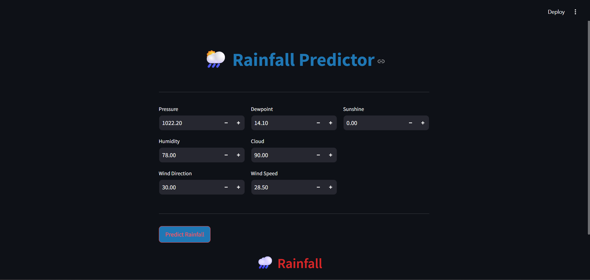

# Rainfall-Prediction-Webapp 🌦️

## 📌 Rainfall Prediction using Random Forest

This project predicts whether rainfall will occur based on meteorological features like temperature, humidity, pressure, dew point, cloud cover, sunshine hours, wind direction, and wind speed.  

A **Random Forest Classifier** is trained and optimized using **GridSearchCV** for better prediction accuracy.

---

## 🌐 Streamlit Web Interface

The application is deployed as a **Streamlit web app**. You can interactively input meteorological features and get instant rainfall predictions.

**Main Page Preview:**  


---

## 🧹 Data Pre-processing Steps

✅ Removed unnecessary features (`day`, `maxtemp`, `temparature`, `mintemp`)  
✅ Handled null values using median/mode  
✅ Converted rainfall labels:  

- yes → 1  
- no → 0  

✅ Downsampled to handle class imbalance  
✅ Visualized data with histograms, correlation heatmaps, and box plots  

---

## 🤖 Machine Learning Model

**Model Used:** Random Forest Classifier  

✅ Hyperparameter tuning with GridSearchCV  
✅ Train-test split: 80% training / 20% testing  
✅ Performance metrics: Accuracy, Confusion Matrix, Classification Report

**Grid Search Parameters:**

```python
# your Python code here
param_grid = {
    'n_estimators': [50, 100, 200],
    'max_depth': [None, 10, 20],
    'min_samples_split': [2, 5, 10],
    'min_samples_leaf': [1, 2, 4],
    'max_features': ['sqrt', 'log2']
}
```
---

## 🐳 Docker Deployment

Run the Streamlit app locally from Docker Hub: <br>

`docker pull 4ffan/rainfall`
